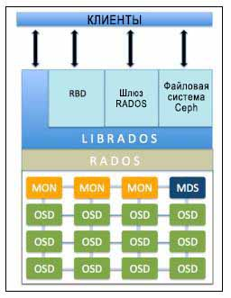

#Архитектура и компоненты Ceph

##Архитектура системы хранения Ceph

Кластер хранения данных состоит из нескольких различных демонов программного обеспечения. Каждый из этих демонов заботится об уникальной функциональности Ceph и добавляет ценность для своих соответствующих компонент.

####RADOS

Безотказное автономное распределенное хранилище объектов (RADOS, Reliable Autonomic Distributed Object Store) является основой хранения данных кластера Ceph. Все в Ceph хранится в виде объектов, а хранилище объектов RADOS отвечает за хранение этих объектов, независимо от их типа данных.

Слой RADOS гарантирует, что данные всегда остаются в согласованном состоянии и надежны. Для согласованности данных он выполняет репликацию данных, обнаружение отказов и восстановление данных, а также миграцию данных и изменение баланса в узлах кластера.

####OSD

Устройство хранения объектов Ceph (OSD, Object Storage Device) хранит все клиентские данные в виде объектов и предоставляет те же данные клиентам при получении от них запросов. Кластер Ceph состоит из множества OSD. Для любой операции чтения или записи клиент запрашивает у мониторов карты кластера, а после этого он могут непосредственно взаимодействовать с OSD для выполнения операций ввода/вывода, без вмешательства монитора.

Каждый объект в OSD имеет одну первичную копию и несколько вторичных копий, которые разбросаны по остальным OSD. Поскольку Ceph является распределенной системой, а объекты распределены по нескольким OSD, каждый OSD выступает первичным OSD для некоторых объектов, и в то же время, он становится вторичным OSD для других объектов. Вторичный OSD остается под контролем основного OSD; однако, они способны стать первичным OSD.

В случае сбоя диска демон Ceph OSD интеллектуально обменивается данными с другими равноправными OSD для выполнения операции восстановления. В течение этого времени хранящие реплицированные копии отказавших объектов вторичные OSD повышают ранг до первичных, и одновременно в ходе операции восстановления OSD создаются новые копии вторичных объектов, причем это полностью прозрачно для клиентов.

####MON

Мониторы Ceph (MON, Ceph monitor) отвечают за контроль состояния работоспособности всего кластера. Это демоны, которые поддерживают режим членства в кластере путем сохранения важной информации о кластере, состояния одноранговых узлов, а также информации о настройках кластера. Монитор Ceph выполняет свои задачи поддерживая главную копию кластера. Карта кластера содержит карты монитора, OSD, PG, CRUSH и MDS.

1. Монитор: Содержит FSID кластера, положение, адреса и порт каждого монитора. Он так же указывает на текущую версию сервера монитора, когда карта была создана и когда в последний раз изменялась. Чтобы просмотреть карту монитора необходимо выполнить команду: `ceph mon dump`

2. OSD: Содержит FSID кластера, когда карта была создана и последние изменения, список пулов, размер репликаций, количество PGs, список OSD и их текущее состояние. Для просмотра OSD карты необходимо выполнить команду: `ceph osd dump`

3. PG: Содержит версию PG, его метки времени, последнию версию OSD, полные соотношения и подробную информацию о каждой группе размещения, такие как PG ID, состояние PG (например active+clean) и т.д. Для просмотра PG карты необходимо выполнить команду: `ceph pg dump`

4. CRUSH: Содержит список устройств хранения, отказоустойчивую иерархию домена (device,host,rack,row,room,datacenter) и правила для иерархий при хранений данных. Для просмотра структуры CRUSH алгоритма необходимо выполнить команду: `ceph osd tree`

5. MDS: Содержит текущую MDS версию карты, когда карта была создана и когда в последний момент изменялась. Так же содержится pool для хранения метаданных, список серверов метаданных и какие сервера включены и выключены. Для просмотра MDS карты, необходимо выполнить `ceph mds dump`

####librados

Библиотека librados является удобным способом получения доступа к RADOS с поддержкой языков программирования PHP, Ruby, Java, Python, C и C++. Она предоставляет собственный интерфейс для кластера хранения данных Ceph, RADOS, и является основанием для других служб, таких как RBD, RGW а также интерфейса POSIX для CephFS. librados API поддерживает прямой доступ к RADOS и позволяет создать свой собственный интерфейс к хранилищу кластера Ceph.

####RBD

Блочное устройство Ceph (Ceph Block Device, известное также как RADOS block device, RBD) предоставляет блочное хранилище, которое может отображаться, форматироваться и монтироваться в точности как любой другой диск в сервере. Блочное устройство Ceph имеет функциональность корпоративных хранилищ, такую как динамичное выделение и моментальные снимки.

RBD использует библиотеки librbd для достижения преимуществ RADOS и обеспечения надежного, полностью распределенного хранилища блоков на основе объектов. Когда клиент записывает данные в RBD, библиотеки librbd преобразовывают блоки данных в объекты и осуществляют их репликацию по всему кластеру, тем самым обеспечивая повышенные производительность и надежность. RBD поверх уровня RADOS поддерживает эффективное обновление объектов. Клиенты могут осуществлять операции записи, добавления и усечения с существующими объектами.

####RGW

Шлюз объектов Ceph (Ceph Object Gateway), также известный как шлюз RADOS (RGW), обеспечивает RESTful интерфейс API совместимый с Amazon S3 (Simple Service Storage) и хранилищами объектов OpenStack API (SWIFT). RGW также поддерживает множественных владельцев и службу проверки подлинности OpenStack Keystone.

####MDS

Сервер метаданных Ceph (MDS, Metadata Server отслеживает метаданные файловой иерархии и сохраняет их только для CephFS. Блочное устройство Ceph и шлюз RADOS не требуют метаданных, следовательно, они не нуждаются в демоне Ceph MDS. MDS не предоставляет данные непосредственно клиентам, тем самым устраняя единую точку отказа в системе.

####CephFS

Файловая система Ceph(CephFS, Ceph File System ) предлагает POSIX- совместимую распределенную файловую систему любого размера. CephFS опирается на CephFS MDS, т.е. метаданные, для хранения иерархии. В настоящее время CephFS не готова к промышленной эксплуатации, однако она является идеальным кандидатом для РОС тестирования. Ее развитие идет очень высоким темпами мы ожидаем, что она появится в промышленной эксплуатации в кратчайшие сроки.