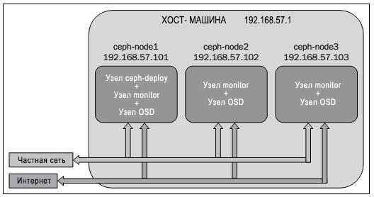

#Пример разворачивания Ceph

##Разворачиание кластера Ceph

В данном отчете использовались 3 машины с CentOS 6.4. Ниже представлена их конфигурация.



Настраиваем **ceph-node1** для регистрации на остальных узлах через SSH без пароля.

Выполните следующие команды на ceph-node1:

При настройке SSH оставьте фразу-пароль пустой и продолжайте с настройками по умолчанию:

```
# ssh-keygen
```

Скопируйте ID ключи SSH на **ceph-node2** и **ceph-node3** предоставляя их пароли root. После этого вы должны быть в состоянии войти на эти узлы без пароля:

````
# ssh-copy-id ceph-node2
````

Устанавливаем и настраиваем **EPEL** на всех узлах Ceph:

```
# rpm -ivh http://dl.fedoraproject.org/pub/epel/6/x86_64/epel-release-6-8.noarch.rpm
```

Убедитесь, что параметр `baserul` разрешен в файле `/etc/yum.repos.d/epel.repo`. Также проверьте, что параметр `mirrorlist` должен быть запрещен (присутствовать в виде комментария) в этом файле.

Устанавливаем `ceph-deploy` на машине **ceph-node1**, выполнив следующую команду на узле ceph-node1:

```
# yum install ceph-deploy
```

Далее мы создаем кластер Ceph с применением `ceph-deploy`, путем выполнения следующей команды на **ceph-node1**:

```
# ceph-deploy new ceph-node1
# mkdir /etc/ceph
# cd /etc/ceph
```

Для установки двоичных кодов программного обеспечения Ceph на все машины выполним следующую команду на **ceph-node1**:

```
# ceph-deploy install --release emperor ceph-node1 ceph-node2 cephnode3
```

Чтобы проверить версию Ceph и состояние Ceph на всех узлах, выполните команду:

```
# ceph –v
```

Создаем наш первый монитор на **ceph-node1**:

```
# ceph-deploy mon create-initial
```

На данном этапе кластер не работоспособен. Для проверки состояния монитора выполните следующую команду.

```
# ceph status
```

Далее создаем OSD и добавляем его в кластер Ceph.

Выводим перечень дисков виртуальной машины:

```
# ceph-deploy disk list ceph-node1
```

В данном отчете мы используем диски SDB, SDC и SDD.

Подкоманда `disk zap` уничтожит существующую таблицу разделов и содержание диска.

```
# ceph-deploy disk zap ceph-node1:sdb ceph-node1:sdc cephnode1:sdd
# ceph-deploy mon create-initial
```

Подкоманда `osd create` сначала подготовит диск, то есть сотрет диск с файловой системой, которой по умолчанию является xfs. Затем она активирует первый раздел диска в качестве раздела данных и второй раздел как журнал:

```
# ceph-deploy osd create ceph-node1:sdb ceph-node1:sdc cephnode1:sdd
```

Проверьте состояние кластера для новых элементов OSD:

```
# ceph status
```

Настраиваем MDS:

```
# ceph-deploy mds create ceph-node2

```
#####Добавление монитора

Теперь у нас есть кластер с одним узлом. Чтобы сделать его распределенным, надежным кластером хранения, мы должны выполнить его масштабирование. Для расширения кластера мы должны добавить больше узлов мониторов и OSD. Теперь будем настраивать машины **ceph-node2** и **ceph-node3** как узлы мониторов и OSD.

Правила межсетевого экрана не должны блокировать связь между узлами мониторов Ceph. Если такие правила имеются, вы должны исправить эти правила межсетевого экрана чтобы мониторы могли формировать кворум. Поскольку в нашем случае мы имеем дело с тестовой установкой, мы запретим межсетевые экраны на всех трех узлах. Запустим эти команды с машины **ceph-node1**:

```
# service iptables stop
# chkconfig iptables off
# ssh ceph-node2 service iptables stop
# ssh ceph-node2 chkconfig iptables off
# ssh ceph-node3 service iptables stop
# ssh ceph-node3 chkconfig iptables off
```

Развернем монитор на **ceph-node2** и **ceph-node3**

```
# ceph-deploy mon create ceph-node2
# ceph-deploy mon create ceph-node3
```

Мы можем столкнуться с предупредительными сообщениями, вызванными расфазировкой синхросигналов на новых узлах мониторов. Чтобы решить эту проблему, нуж6о установить **Network Time Protocol (NTP)** на новых узлах монитора:

```
# chkconfig ntpd on
# ssh ceph-node2 chkconfig ntpd on
# ssh ceph-node3 chkconfig ntpd on
# ntpdate pool.ntp.org
# ssh ceph-node2 ntpdate pool.ntp.org
# ssh ceph-node3 ntpdate pool.ntp.org
# /etc/init.d/ntpd start
# ssh ceph-node2 /etc/init.d/ntpd start
# ssh ceph-node3 /etc/init.d/ntpd start
```

#####Добавление OSD

Для осуществления этой задачи мы будем выполнять последующие команды с машины **ceph-node2**:

```
# ceph-deploy disk list ceph-node2 ceph-node3
# ceph-deploy disk zap ceph-node2:sdb ceph-node2:sdc ceph-node2:sdd
# ceph-deploy disk zap ceph-node3:sdb ceph-node3:sdc ceph-node3:sdd
# ceph-deploy osd create ceph-node2:sdb ceph-node2:sdc ceph-node2:sdd
# ceph-deploy osd create ceph-node3:sdb ceph-node3:sdc ceph-node3:sdd
# ceph status
```

##CephFS

Для реализации файловой системы Ceph необходимо запустить кластер хранения Ceph и, по крайней мере, один MDS.

Ceph является системой хранения; для сохранения ваших данных в кластере Ceph вам понадобится машина клиента. После того, как пространство хранения подготовлено к работе в кластере Ceph, клиент отображает или монтирует блок или файловую систему и позволяет нам сохранять данные в кластере Ceph. Для того, чтобы сохранять данные в хранилище объектов клиенты имеют HTTP доступ. Обычный кластер Ceph промышленного класса содержит две различные сети, сеть переднего плана и сеть заднего плана, также называемые общедоступной сетью и сетью кластера, соответственно.

Сеть переднего плана является сетью клиентов, через которую Ceph предоставляет данные своим клиентам. Клиенты не имеют доступ к сети заднего плана и Ceph в основном использует сеть заднего плана для репликаций и восстановления.

Далее необходимо настроить сеть на дополнительной машине клиента.

Измените файл `/etc/sysconfig/network-scripts/ifcfg-eth0` и добавьте в него следующее:

```
ONBOOT=yes
BOOTPROTO=dhcp
```

Измените файл `/etc/sysconfig/network-scripts/ifcfg-eth1` и добавьте в него следующее:

```
ONBOOT=yes
BOOTPROTO=static
IPADDR=192.168.57.200
NETMASK=255.255.255.0
```

Измените файл `/etc/hosts` и добавьте в него следующее:

```
192.168.57.101 ceph-node1
192.168.57.102 ceph-node2
192.168.57.103 ceph-node3
192.168.57.200 ceph-client1
```

####Монтирование CephFS с применением драйвера ядра

Ядро Linux 2.6.34 и более поздние версии внутренне поддерживают Ceph.

Проверьте версию ядра Linux вашего клиента:

```
# uname -r
```

Создайте каталог точки монтирования:

```
# mkdir /mnt/kernel_cephfs
```

Запишите секретный ключ администратора:

```
# cat /etc/ceph/ceph.client.admin.keyring
```

Смонтируйте CephFS с применением внутреннего вызова монтирования Linux. Его синтаксис такой:

`mount -t ceph <Monitor_IP>:<Monitor_port>:/ <mount_point_name> -o name=admin,secret=<admin_secret_key>`

Ниже представлен пример:

```
# mount -t ceph 192.168.57.101:6789:/ /mnt/kernel_cephfs -o name=admin,secret=AQAinItT8Ip9AhAAS93FrXLrrnVp8/sQhjvTIg==
```

Для более безопасного монтирования можно сохранить ключ безопасности администратора в отдельном текстовом файле и использовать его при монтировании:

```
# echo AQAinItT8Ip9AhAAS93FrXLrrnVp8/sQhjvTIg== > /etc/ceph/adminkey
# mount -t ceph 192.168.57.101:6789:/ /mnt/kernel_cephfs -o name=admin,secretfile=/etc/ceph/adminkey
```

Чтобы смонтировать CephFS в вашу таблицу файловой системы добавьте следующие строки в файл `/etc/fstab` клиента. Синтаксис для этого следующий:

`<Mon_ipaddress>:<monitor_port>:/ <mount_point> <filesystemname> [name=username,secret=secretkey|secretfile=/path/to/secretfile],[{mount.options}]`.

Ниже приводится пример команды:

```
192.168.57.101:6789:/ /mnt/kernel_ceph ceph name=admin,secretfile=/etc/ceph/adminkey,noatime 0 2
```